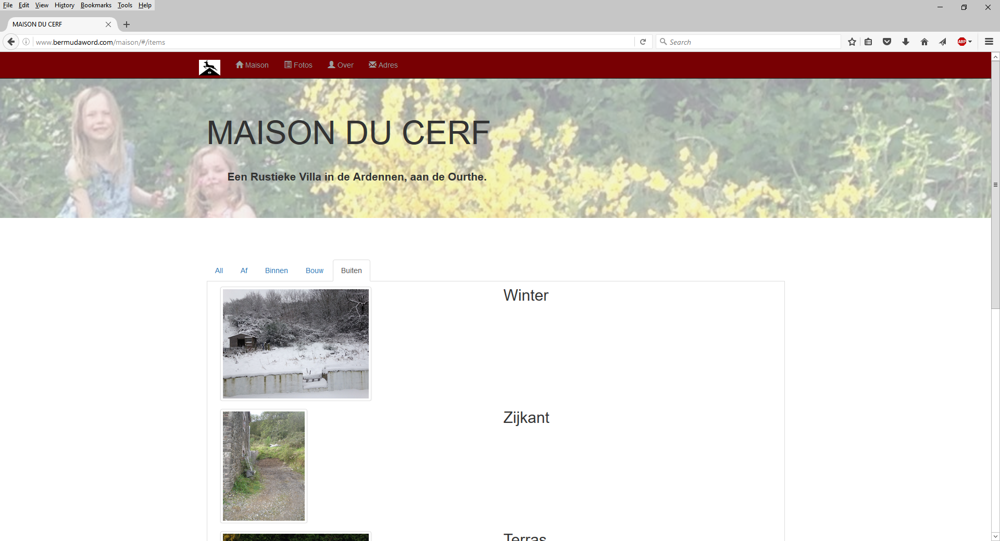
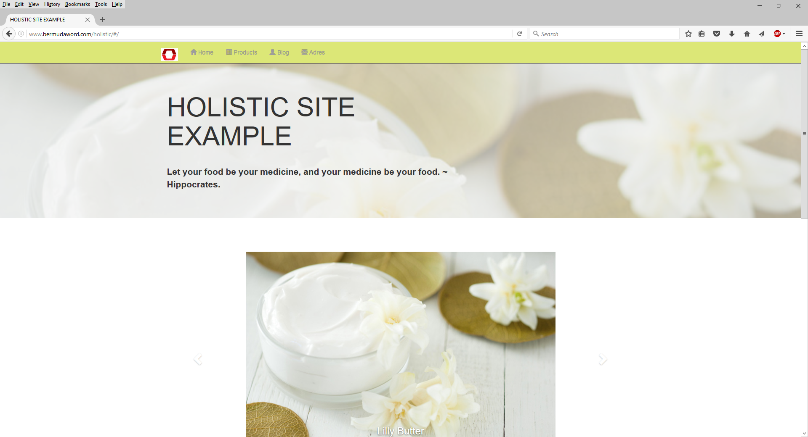
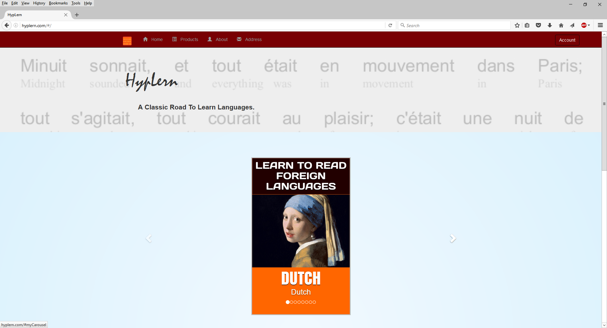

# ittolaja-generator

<b>In progress</b>

  <li>rewriting to ES6 syntax and using webpack</li>
  <li>changing from scripted version to online forms / editable site</li>

<h3>Version 2.0</h3>
Full-stack Node-express-Mongodb-mongoose-Angular-bootstrap website generator based on json back-end data created on ittolaja.com (not online yet) in-website.

<h3>Version 1.0</h3>
Front-end Angular-bootstrap website generator based on json file created by perl script and batch input. 

</img>

</img>

</img>
